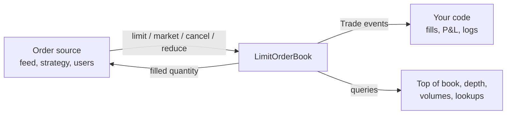
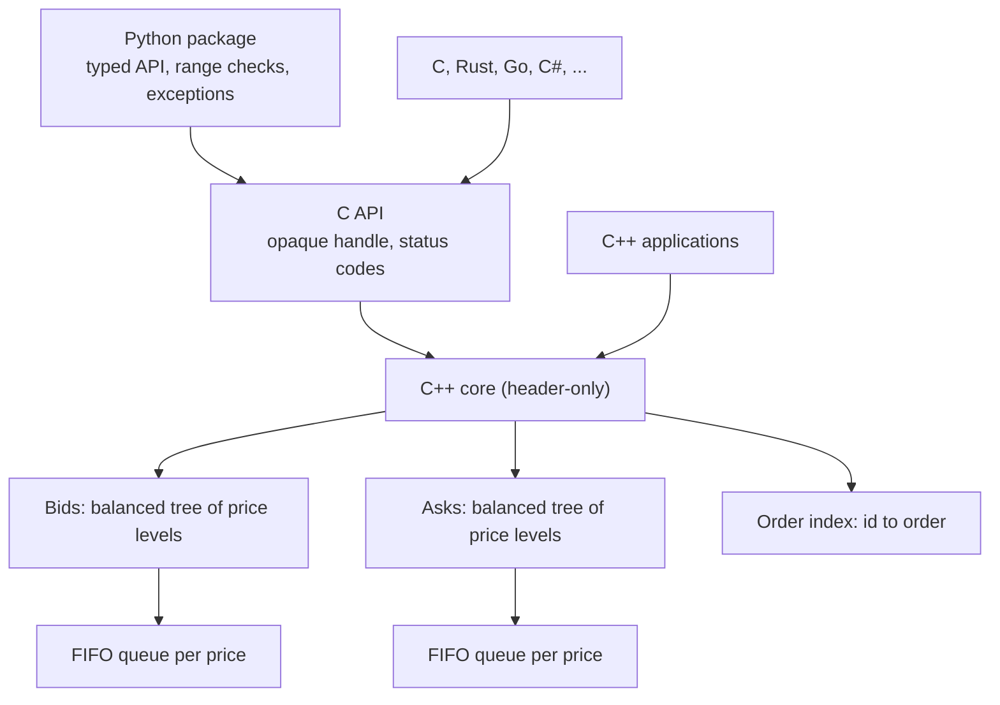
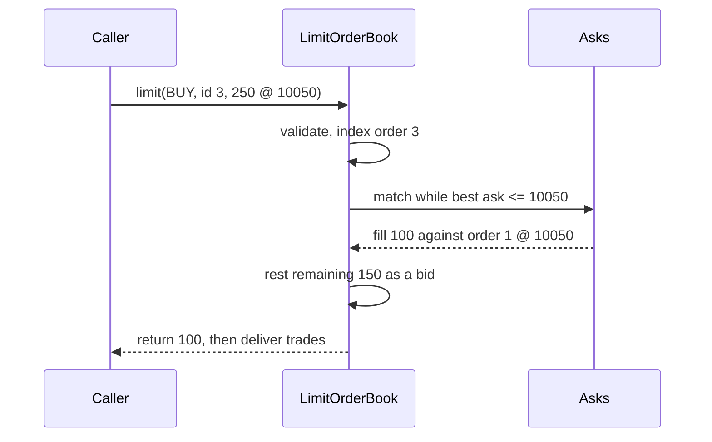

# Orderly Chaos

[](https://github.com/Meetmendapara09/Orderly-Chaos/actions/workflows/ci.yml)
[](LICENSE)


**A fast, thoroughly tested limit order book with price-time priority matching.**
A header-only C++17 core, a stable C API, and a typed Python package, all
sharing one engine.

```python
from orderly_chaos import LimitOrderBook, Side

book = LimitOrderBook(on_trade=print)
book.limit(Side.SELL, order_id=1, quantity=100, price=10_050)   # rests: 0 filled
book.limit(Side.BUY, order_id=2, quantity=40, price=10_050)     # trades: 40 filled
print(book.best_sell(), book.volume_sell())                     # 10050 60
```

## Contents

- [What it does](#what-it-does)
- [Use cases](#use-cases)
- [When to use it](#when-to-use-it)
- [Installation](#installation)
- [Quick start](#quick-start)
- [How it works](#how-it-works)
- [Performance](#performance)
- [Project structure](#project-structure)
- [Documentation](#documentation)
- [Development](#development)
- [License and credits](#license-and-credits)

## What it does

A **limit order book** holds all open buy orders (bids) and sell orders (asks)
for an instrument, sorted by price. When a new order is willing to trade at
the price of an order on the other side, the book **matches** them and
produces trades. Orderly Chaos implements this with exchange-style rules:

- **Price-time priority:** the best price trades first; at equal prices, the
  oldest order trades first.
- **Trades at the resting price:** an aggressive buy at 105 against an ask at
  100 trades at 100.
- **Limit orders** trade as far as their price allows, then rest.
  **Market orders** are immediate-or-cancel.
- **Cancel** removes an order; **reduce** lowers its size while keeping its
  place in the queue.
- **Trade events** report every execution (taker, maker, price, quantity).
- **Safe by default:** duplicate IDs, zero quantities or prices, and unknown
  orders are rejected without changing the book.
- **Market data queries:** best bid and ask, mid price, spread, volumes and
  order counts per side or price, and depth snapshots.



## Use cases

| Use case | How the book is used |
|----------|----------------------|
| **Market data replay** | Rebuild an instrument's book from an order-by-order feed and read prices, depth, and volumes at any moment. |
| **Backtesting** | Simulate where a strategy's orders would sit in the queue and when they would actually fill. |
| **Exchange simulators** | Use it as the matching core of a paper-trading venue, game, classroom exchange, or internal crossing engine. |
| **Microstructure research** | Run agent-based simulations with millions of events per second. |
| **Teaching** | Demonstrate price-time priority, partial fills, and immediate-or-cancel orders with runnable code. |

## When to use it

| Use Orderly Chaos when you need | Look elsewhere if you need |
|---------------------------------|----------------------------|
| A continuous price-time priority book per instrument | A complete exchange with networking, risk checks, and persistence |
| Limit, market (IOC), cancel, and reduce operations | Pro-rata or auction matching |
| Integer prices in ticks, no floating-point drift | Built-in stop, iceberg, fill-or-kill, or post-only orders (build them on top) |
| Millions of operations per second on one thread | Many threads writing one book without your own lock |
| The same engine from C++, C, Python, or any C FFI | Prices that cannot be expressed as integer ticks |

## Installation

**Python** (3.9+) from PyPI, no compiler needed:

```bash
python -m pip install orderly-chaos
```

From source (pip compiles the native library; needs a C++17 compiler):

```bash
git clone https://github.com/Meetmendapara09/Orderly-Chaos.git
cd Orderly-Chaos
python -m pip install .
```

**Docker:** `docker run --rm ghcr.io/meetmendapara09/orderly-chaos:latest`

**C++** (header-only): add `include/` and `third_party/robin_map/include/` to
your include path and `#include <orderly_chaos/orderly_chaos.hpp>`. With
Bazel, depend on `//:orderly_chaos`.

**C and other languages:** `bazel build //:shared_lib` produces
`lib_orderly_chaos.so` / `.dylib` / `.dll`, exporting the C API declared in
[`include/orderly_chaos/orderly_chaos.h`](include/orderly_chaos/orderly_chaos.h).

See [Getting started](docs/getting-started.html) for platform notes (including
Windows) and troubleshooting.

## Quick start

### Python

```python
from orderly_chaos import LimitOrderBook, Side, UnknownOrderIdError

trades = []
book = LimitOrderBook(on_trade=trades.append)

book.limit(Side.SELL, order_id=1, quantity=100, price=10_050)  # ask 100 @ 100.50
book.limit(Side.BUY, order_id=2, quantity=150, price=10_000)   # bid 150 @ 100.00

filled = book.limit(Side.BUY, order_id=3, quantity=250, price=10_050)
print(filled, book.get(3).quantity)        # 100 150: traded 100, 150 rest at 10050
print(trades[0].maker_id, trades[0].price) # 1 10050

for level in book.depth(Side.BUY, levels=5):
    print(level.price, level.volume, level.count)

try:
    book.cancel(999)
except UnknownOrderIdError as error:
    print(error)                           # cancel order 999: unknown order id [OC_ERR_UNKNOWN_ORDER_ID]
```

### C++

```cpp
#include <iostream>
#include <orderly_chaos/orderly_chaos.hpp>

int main() {
    using namespace orderly_chaos;
    LimitOrderBook book;
    book.set_trade_handler([](const Trade& t) {
        std::cout << t.quantity << " @ " << t.price << '\n';
    });
    book.limit(Side::Sell, 1, 100, 10'050);
    const Quantity filled = book.limit(Side::Buy, 2, 250, 10'050);  // 100
    std::cout << "filled " << filled << ", best bid " << book.best_buy() << '\n';
}
```

### C

```c
#include <orderly_chaos/orderly_chaos.h>

oc_book* book = oc_book_new();
uint32_t filled = 0;
oc_book_limit(book, OC_SIDE_SELL, 1, 100, 10050, NULL);
oc_status status = oc_book_limit(book, OC_SIDE_BUY, 2, 250, 10050, &filled);  /* OC_OK, filled == 100 */
oc_book_free(book);
```

More complete programs, including market data replay and a market-making
simulation, are in [`examples/`](examples/).

## How it works



Each side keeps its price levels in a balanced tree (guaranteed O(log L) to
add or remove a level) plus a hash index for O(1) access to existing levels.
Each level is an intrusive FIFO queue, so joining a level and cancelling are
O(1). Best price, volumes, and counts are cached and updated incrementally.



Read the full [architecture guide](docs/architecture.md) for the object model,
complexity of every operation, memory ownership, and error boundaries.

## Performance

Median of 7 runs, one million operations, optimized build, one thread on an
AMD EPYC 7763 cloud VM:

| Scenario | ns / op | ops / s |
|----------|--------:|--------:|
| Best bid, ask, and volumes (all four) | 1 | 965 M |
| Limit order joining an existing level | 52 | 19.2 M |
| Mixed flow (60% limit, 10% market, 30% cancel) | 158 | 6.3 M |
| Market order filling one order | 220 | 4.5 M |
| Cancel in random order | 387 | 2.6 M |

Version 0.2.0 replaced an unbalanced price tree whose cost grew linearly when
prices trend; with 100,000 rising price levels each insert is now **447 times
faster** (400 ns instead of 179 us). Reproduce with `make bench`; methodology
in [Benchmarks](docs/benchmarks.html).

## Project structure

```text
include/orderly_chaos/   Public headers: C++ API (*.hpp) and C API (orderly_chaos.h)
src/                     C API implementation (built into the shared library)
python/orderly_chaos/    Python package (ctypes bindings, types, exceptions)
tests/cpp/               C++ tests (GoogleTest), including a randomized reference-model test
tests/python/            Python tests (unittest, pytest compatible)
examples/                Runnable C++, C, and Python examples (run by the test suite)
benchmarks/              Benchmark harness
docs/                    Documentation website and design notes
third_party/             Vendored tsl::robin_map, GoogleTest build file
toolchain/               Optional MinGW-w64 toolchain for Windows Bazel builds
```

## Documentation

| Document | Contents |
|----------|----------|
| [Overview](docs/overview.html) | Concepts, matching rules, order lifecycle, errors, threading |
| [Getting started](docs/getting-started.html) | Installation, verification, first program, troubleshooting |
| [Architecture](docs/architecture.md) | Design, data structures, complexity, testing strategy |
| [Python API](docs/api/python.html) | Every class, method, type, and exception |
| [C++ API](docs/api/cpp.html) | `LimitOrderBook`, types, errors, guarantees |
| [C API](docs/api/c.html) | Functions, structs, status codes, FFI usage |
| [Examples](docs/examples/index.html) | Annotated walkthroughs of the example programs |
| [Benchmarks](docs/benchmarks.html) | Results, methodology, reproduction |

The HTML pages form a static site in [`docs/`](docs/); preview it with
`make serve-docs`. See [`docs/README.md`](docs/README.md) for how the site is
organized.

## Development

```bash
make test          # C++ tests, examples, and Python tests
make test-cpp      # bazel test //...
make test-python   # Python tests against the Bazel-built library
make bench         # benchmarks (optimized build)
make help          # all targets
```

Requirements: Bazel 7+ (or Bazelisk), Python 3.9+, and a C++17 compiler.
Please read [CONTRIBUTING.md](CONTRIBUTING.md) before opening a pull request,
and [SECURITY.md](SECURITY.md) to report a vulnerability. Changes are listed
in [CHANGELOG.md](CHANGELOG.md).

## License and credits

Orderly Chaos is created and maintained by **Meet Mendapara** and released
under the [MIT License](LICENSE). Third-party components and their licenses
are listed in [THIRD_PARTY_NOTICES.md](THIRD_PARTY_NOTICES.md).
