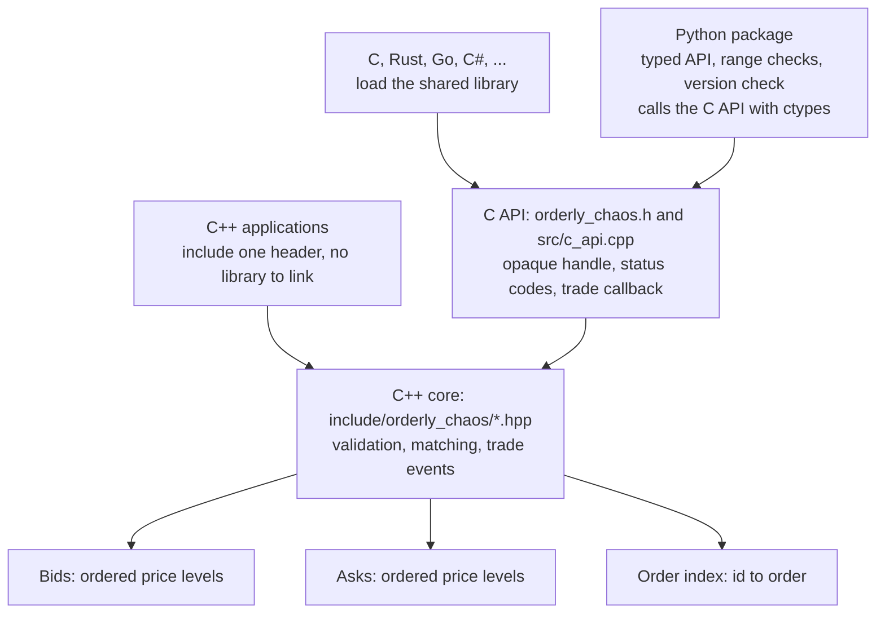
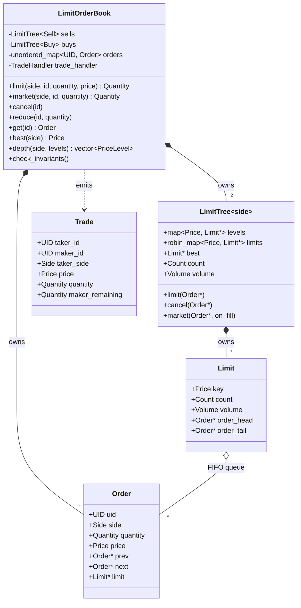
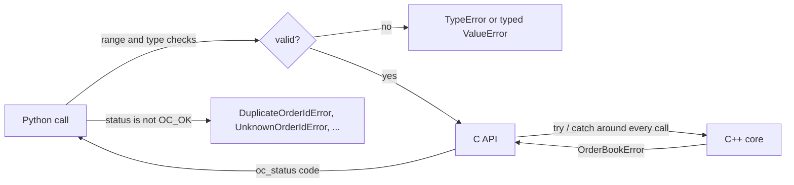

# Architecture

This document describes how Orderly Chaos is built: its layers, the data
structures behind each operation, the matching algorithm, and the guarantees
each layer provides. A styled version with the same diagrams is available in
[architecture.html](architecture.html).

## Contents

- [Layers](#layers)
- [Object model](#object-model)
- [Data structures](#data-structures)
- [Matching algorithm](#matching-algorithm)
- [Complexity](#complexity)
- [Memory and ownership](#memory-and-ownership)
- [Error boundaries](#error-boundaries)
- [Concurrency](#concurrency)
- [Testing strategy](#testing-strategy)
- [Design decisions](#design-decisions)

## Layers

The engine is a header-only C++17 core. Two thin layers expose it to other
languages without duplicating any logic, so every API behaves identically.

| Layer | Responsibility | Files |
|-------|----------------|-------|
| C++ core | Validation, matching, book state, trade events, invariant checks | `types.hpp`, `errors.hpp`, `limit_tree.hpp`, `limit_order_book.hpp`, `version.hpp` |
| C API | Stable ABI, exception firewall, status codes, plain structs | `orderly_chaos.h`, `src/c_api.cpp` |
| Python | Pythonic API, range checks (ctypes silently wraps integers), typed errors, library discovery and version check | `python/orderly_chaos/*.py` |

## Object model

## Data structures

| Structure | Type | Purpose | Cost |
|-----------|------|---------|------|
| Ordered price levels | `std::map<Price, Limit*>` (red-black tree) | Find the next best level, walk depth in price order | O(log L) insert and erase, guaranteed |
| Level index | `tsl::robin_map<Price, Limit*>` | Reach an existing level without touching the tree | O(1) average |
| Queue per level | Intrusive doubly linked list through `Order` | Time priority; unlink any order | O(1), no allocation |
| Order index | `std::unordered_map<UID, Order>` | Cancel, reduce, and lookup by ID; owns orders with stable addresses | O(1) average |
| Cached aggregates | Best level, volume, count per side and per level | Top of book and volume queries | O(1) |

L is the number of price levels on one side.

Before v0.2.0 the levels lived in an unbalanced binary search tree. Prices that
arrive in rising or falling order (a trending market) turn such a tree into a
linked list, making each new level O(L). With 100,000 rising levels the
balanced tree is 447 times faster per insert; see
[benchmarks.html](benchmarks.html#regression).

## Matching algorithm

```mermaid
sequenceDiagram
    autonumber
    participant U as Caller
    participant B as LimitOrderBook
    participant S as Sell side
    participant T as Buy side
    participant H as Trade handler
    U->>B: limit(BUY, id=4, qty=250, price=10050)
    B->>B: validate quantity, price, and ID
    B->>B: insert order 4 into the order index
    B->>S: market(order 4)
    loop while order 4 has quantity and best ask is at most 10050
        S->>S: take the oldest order at the best ask
        S-->>B: on_fill(maker, price, quantity, filled)
        B->>B: record Trade, erase filled maker from index
    end
    B->>T: limit(order 4) with the remaining 150
    B->>H: deliver recorded trades in order
    B-->>U: return 100 (quantity filled)
```

1. **Validate** before touching any state: quantity at least 1, limit price at
   least 1, and the ID not already resting.
2. **Match** against the opposite side while the incoming order has quantity
   and its price crosses the best opposite level. Within a level the oldest
   order (queue head) trades first, always at the level's (maker's) price.
3. **Rest** any remainder at the back of its own level's queue. Market orders
   skip this step: the remainder is discarded.
4. **Deliver** trade events after the book is consistent again.

Internally a price of 0 means "no limit", which is how market orders reuse the
matching loop and why 0 is rejected as a limit price.

## Complexity

k is the number of resting orders an incoming order fills and e the number of
levels it empties.

| Operation | Cost |
|-----------|------|
| Best bid or ask, best volume, total volume, counts | O(1) |
| `has`, `get`, volume or count at a price | O(1) average |
| Limit order at an existing price | O(1) average |
| Limit order at a new price | O(log L) |
| Cancel | O(1) average; O(log L) if it empties its level |
| Partial reduce | O(1) average |
| Market or crossing limit order | O(k + e log L) |
| Depth snapshot of n levels | O(n) |

## Memory and ownership

- The book owns every `Order` (in the order index); each side owns its `Limit`
  objects. Everything is released by RAII on `clear()` or destruction.
- Books are movable but not copyable, because copying would duplicate the raw
  pointers that link queues.
- Memory is proportional to resting orders and levels, not to the number of
  operations. Trade events reuse one buffer.
- `get()` in C++ returns a reference that the next modifying call invalidates.
  The C and Python APIs return copies.

## Error boundaries

- Every rejection happens before any state changes, so a failed call leaves
  the book exactly as it was.
- If memory allocation fails during matching, the book stays consistent: the
  trades already made are kept and the incoming order is dropped.
- If a trade handler throws, all remaining trades of that operation are still
  delivered and the first exception is rethrown afterwards.
- The C API catches every exception; nothing propagates across the FFI.

## Concurrency

A book is single-threaded by design. Use one book per instrument and one
thread per book, or synchronise externally. The Python package loads the
library with `ctypes.PyDLL`, which keeps the GIL held during calls; plain
`ctypes.CDLL` would release it and let two threads enter a book at once.
Individual Python calls are therefore atomic, but sequences of calls are not.

## Testing strategy

| Suite | What it proves |
|-------|----------------|
| `tests/cpp/test_types.cpp`, `test_limit_tree.cpp`, `test_limit_order_book.cpp` | Behaviour of each structure and of the book in hand-written scenarios |
| `tests/cpp/test_validation.cpp` | Every rejection, return values, queries, move semantics, and a 200,000-level monotonic-price scale test |
| `tests/cpp/test_trades.cpp` | Trade events, price-time priority, maker pricing, throwing handlers |
| `tests/cpp/test_randomized.cpp` | Random order flow compared step by step with an independent reference book (trades, errors, prices, depth), with full invariant checks after every step |
| `tests/cpp/test_c_api.cpp` | Status codes, NULL handling, struct layouts, callbacks |
| `tests/python/` | Python API, validation, threading, library loading, a Python reference model, and every Python example |
| `examples/`, `benchmarks/` | Built and run as tests so that documentation code cannot rot |

The randomized test was verified to catch real defects: deliberately breaking
time priority makes it fail immediately.

## Design decisions

**Integer prices.** Floating-point prices cannot be compared or hashed
reliably, which would break price levels. Callers choose a tick size.

**Balanced tree plus hash index.** The tree guarantees O(log L) worst-case
level changes and ordered depth walks; the hash index keeps the most common
operation, joining an existing level, O(1).

**Deferred trade delivery.** Trades are buffered during matching and delivered
once the book is consistent, so handlers can safely query the book and a
throwing handler cannot corrupt it.

**Exceptions in C++, status codes in C.** Each is idiomatic in its language,
and the C layer guarantees that no exception crosses an FFI boundary.

**Validation in Python as well.** ctypes silently truncates integers that do
not fit the C type (for example 2**32 becomes 0), so the Python layer checks
ranges before calling into C.
